# Ownerr

Ownerr is a **multi-product platform** for startup acquisition, founder tooling, and a member network. The primary user-facing app is a **React + TypeScript SPA** (`artifacts/ownerr-web-app`), deployed on **Vercel**, with **Supabase** (Auth, Postgres, RLS, RPCs) as the production backend for marketplace buyer/seller desks, offers, messaging, verification, admin, and product provisioning.

This document describes **what the system is for**, **who uses it**, **how major flows work**, and **how to run it**. Deeper API and schema notes live under [`docs/architecture/`](docs/architecture/).

## Table of contents

**Getting started**

- [Products and use cases](#products-and-use-cases)
- [Quick start (about 5 minutes)](#quick-start-about-5-minutes)
- [Glossary](#glossary)
- [Demo accounts (after seed)](#demo-accounts-after-seed)

**Architecture**

- [High-level system architecture](#high-level-system-architecture)
- [Monorepo layout](#monorepo-layout)
- [Authentication and routing](#authentication-and-routing)
- [Data and security model](#data-and-security-model)
- [Client ↔ Supabase map](#client-supabase-map)
- [Errors and RPC fallbacks](#errors-and-rpc-fallbacks)
- [Observability](#observability)
- [Schema v2 (marketplace)](#schema-v2-marketplace)

**Marketplace flows**

- [Public discovery](#marketplace-public-discovery)
- [Buyer desk flow](#marketplace-buyer-desk-flow)
- [Seller desk flow](#marketplace-seller-desk-flow)
- [Offers and acquisition stages](#offers-and-acquisition-stages)
- [Messaging and inbox](#messaging-and-inbox)
- [Listing verification and trust](#listing-verification-and-trust)
- [Dual desk](#dual-desk-same-account-two-roles)
- [End-to-end deal happy path](#end-to-end-deal-happy-path-marketplace)
- [Product provisioning after login](#product-provisioning-after-login)
- [Listing lifecycle (states)](#listing-lifecycle-states)
- [Key marketplace routes](#key-marketplace-routes-reference)

**Other products**

- [Ownerr Network](#ownerr-network-member-flow)
- [Ownerr OS](#ownerr-os-founder-flow)
- [Platform admin](#platform-admin)
- [Feature matrix](#feature-matrix-by-surface)

**Deploy, develop, and test**

- [Environment and deployment](#environment-and-deployment)
  - [Required environment variables](#required-environment-variables)
  - [Secrets matrix](#secrets-matrix-where-things-live)
  - [Vercel project settings](#vercel-project-settings)
  - [Migration playbook](#migration-playbook)
  - [Webhook and Edge checklist](#webhook-and-edge-checklist-production)
- [Local development](#local-development)
  - [Production smoke (manual)](#production-smoke-manual)
- [Contributing](#contributing)
- [Known limitations](#known-limitations)
- [Troubleshooting](#troubleshooting)

**Reference**

- [Architecture docs (detail)](#architecture-docs-detail)
- [Tech stack](#tech-stack)
- [Export Mermaid diagrams](#export-mermaid-diagrams)

---

## Products and use cases

| Product | Who | Primary use cases |
| -------- | ----- | ----------------- |
| **Marketplace (Acquire)** | Buyers, sellers (founders) | Discover listings, express interest, negotiate in inbox, submit/counter/accept **offers**, person + listing **verification**, trust signals |
| **Ownerr OS** | Founders | Founder workspace: listings, analytics, profile (product app under `/ownerr-os/app`) |
| **Ownerr Network** | Members | Onboarding, discover, referrals, wallet/ledger, leaderboard, public member profiles |
| **Platform admin** | Internal operators | Marketplace buyers/sellers/listings/verification/offers; Network members/ledger; OS founders; ops/system health |
| **Public marketing** | Visitors | Landing, products, valuation tool, market intelligence, public listing pages |

**Dual desk:** One authenticated user can hold **both** a **buyer** and a **seller** marketplace profile. The app infers desk role from the URL path (`/marketplace/app/buyer/...` vs `/marketplace/app/seller/...`) and syncs provisioning accordingly.

---

## Quick start (about 5 minutes)

1. Clone the repo and install from the **root**: `npm install`
2. Copy [`.env.example`](.env.example) → `.env.local` and set `VITE_SUPABASE_URL`, `VITE_SUPABASE_ANON_KEY`, `VITE_PUBLIC_SITE_URL` (local can use `http://localhost:5173`)
3. Apply migrations: `npm run db:migrate` (requires `DATABASE_URL` or pooler URL in `.env.local` — see [supabase/README.md](supabase/README.md))
4. Optional demo data: `npm run marketplace:seed-demo`
5. Start the app: `npm run dev` → open the URL Vite prints (usually `http://localhost:5173`)
6. Sign in as demo buyer or seller (see [Demo accounts](#demo-accounts-after-seed)) and open `/marketplace/app/buyer/dashboard` or `/marketplace/app/seller/dashboard`

Before opening a PR: `npm run check` and `npm run build` from the repo root ([local verification](docs/local-verification.md)).

---

## Glossary

| Term | Meaning |
| ------ | -------- |
| **Desk** | Buyer or seller role in the Marketplace **app** shell (URL path + `marketplace_profiles.desk_role`) |
| **Profile / account** | Marketplace identity row(s) for a user; schema v2 may expose `marketplace_accounts` with legacy aliases reconciled in migrations |
| **Gate** | Verification requirement (domain, revenue, email, identity, etc.) that must pass before publish |
| **Lifecycle** | Listing state (draft → in verification → published, etc.) driven by gates and RPCs |
| **Interest** | Buyer expression of interest on a listing; may link to inbox repair/bootstrap |
| **Conversation** | Buyer–seller message thread tied to a listing (and optionally an offer) |
| **Offer / bid** | Formal acquisition offer with DB-enforced status (see offers state diagram below) |
| **Provision** | Creating/updating product membership and desk profiles after auth (`provisionMarketplaceProduct`, Network/OS analogs) |

---

## High-level system architecture

Production default: **no separate Express API** for marketplace desks. The browser talks to Supabase; optional Vercel `/api/*` routes handle webhooks and verification proxying.

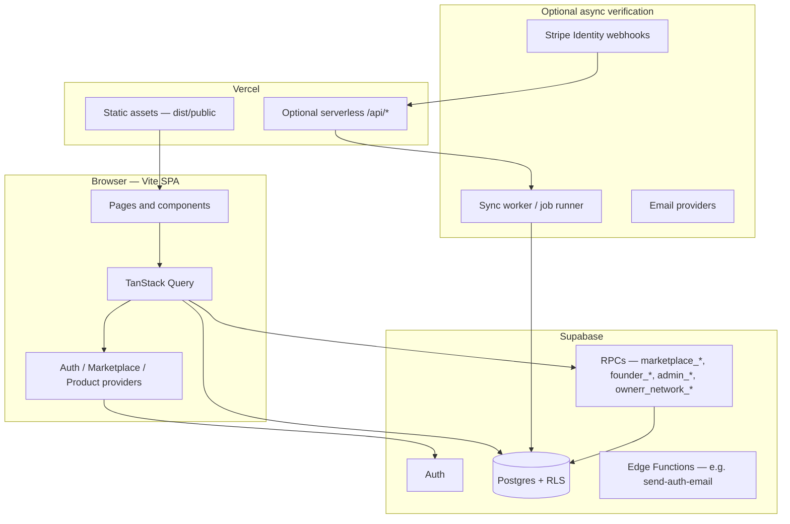

Canonical route constants: [`artifacts/ownerr-web-app/src/routing/routeRegistry.ts`](artifacts/ownerr-web-app/src/routing/routeRegistry.ts).

---

## Monorepo layout

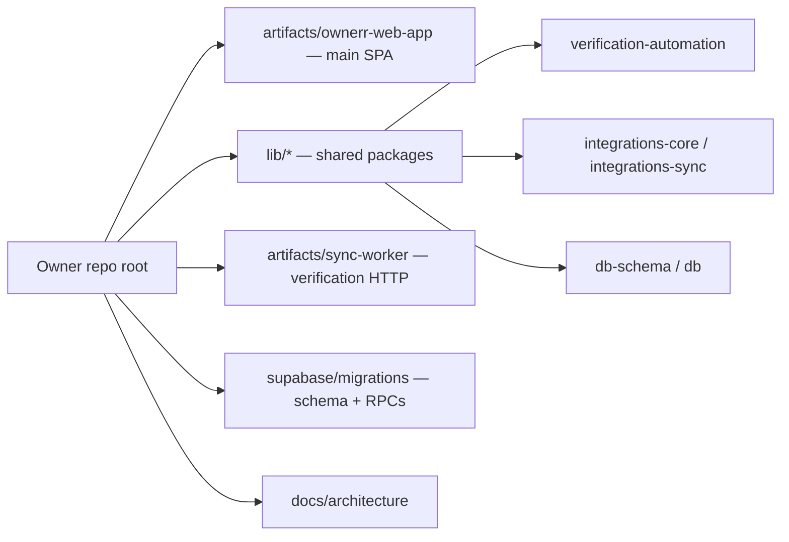

| Path | Role |
| ------ | ------ |
| `artifacts/ownerr-web-app` | Vite app, routing, UI, client services calling Supabase |
| `lib/verification-automation` | Stripe identity webhook handling, verification helpers |
| `lib/integrations-*` | Revenue/domain provider catalog and sync |
| `artifacts/sync-worker` | Local/optional HTTP worker for async verification jobs |
| `supabase/migrations` | Source of truth for tables, RLS, RPCs |
| `scripts/` | Migrations apply, QA seed, smoke tests |

---

## Authentication and routing

Auth is **Supabase Auth** (email/password, OTP, confirm links). Product access is gated by **route registry** definitions, **desk role**, **onboarding**, and **platform admin** role in Postgres.

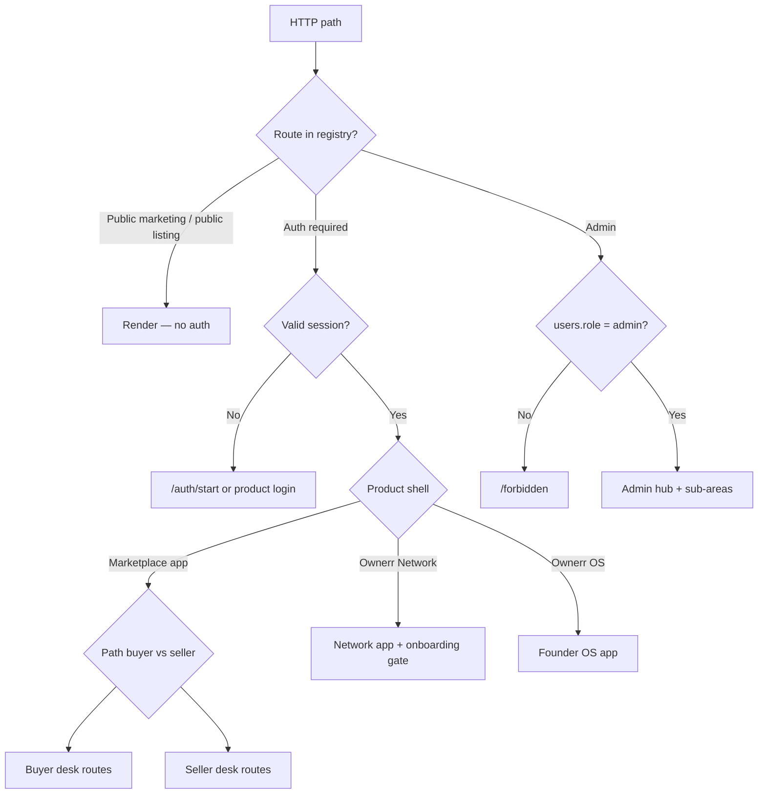

**Auth-related paths**

- `/auth/start`, `/auth/confirm`, `/auth/verify-email`, `/auth/reset-password`, `/auth/reauthenticate`
- Product-scoped login/callback under `/products/{product}/login` and callbacks

**After login:** User is sent to the **active product** default (e.g. marketplace buyer dashboard) or the URL they attempted.

---

<a id="marketplace-public-discovery"></a>

## Marketplace — public discovery

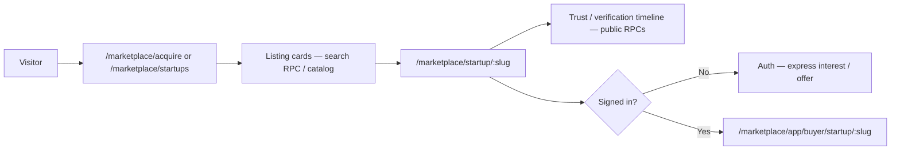

**Use cases:** SEO-friendly browse, compare startups, read verification timeline, jump into authenticated buyer desk actions.

---

<a id="marketplace-buyer-desk-flow"></a>

## Marketplace — buyer desk flow

Base path: `/marketplace/app/buyer`.

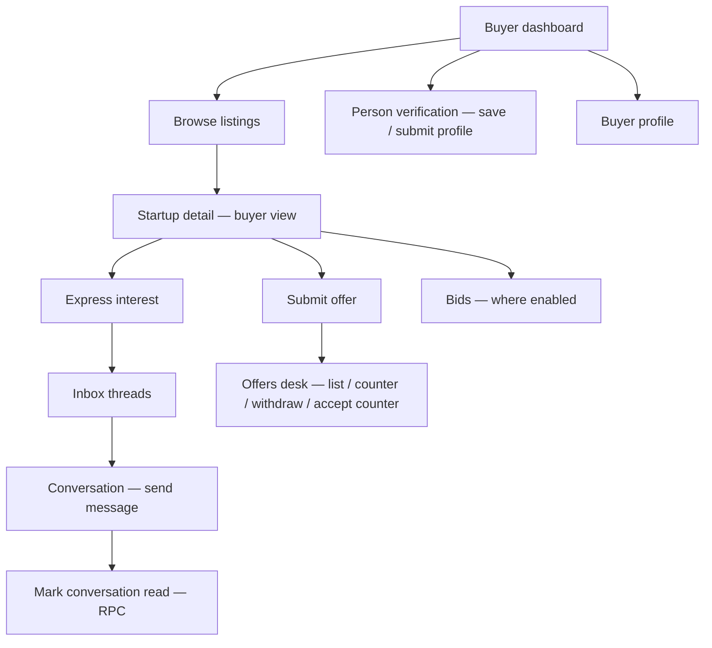

**Backend (typical RPCs):** `marketplace_list_conversations`, `marketplace_list_messages`, `marketplace_send_message`, `marketplace_mark_conversation_read`, `marketplace_submit_offer`, `marketplace_list_offers_buyer`, interest/repair helpers. See [`docs/architecture/api-catalog.md`](docs/architecture/api-catalog.md).

**Client behavior:** Inbox uses bounded polling for open threads; mark-read runs **once per conversation open** to avoid API storms.

---

<a id="marketplace-seller-desk-flow"></a>

## Marketplace — seller desk flow

Base path: `/marketplace/app/seller`.

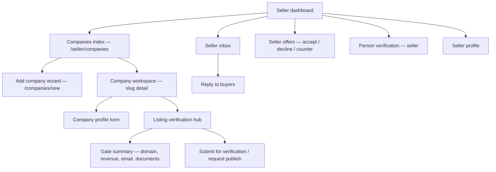

**Use cases:** Founder lists a company, connects revenue providers (keys encrypted in DB), completes verification gates, publishes when allowed, manages inbound interest and formal offers.

---

## Offers and acquisition stages

Offers are **DB-enforced state machines**, not mock pipelines.

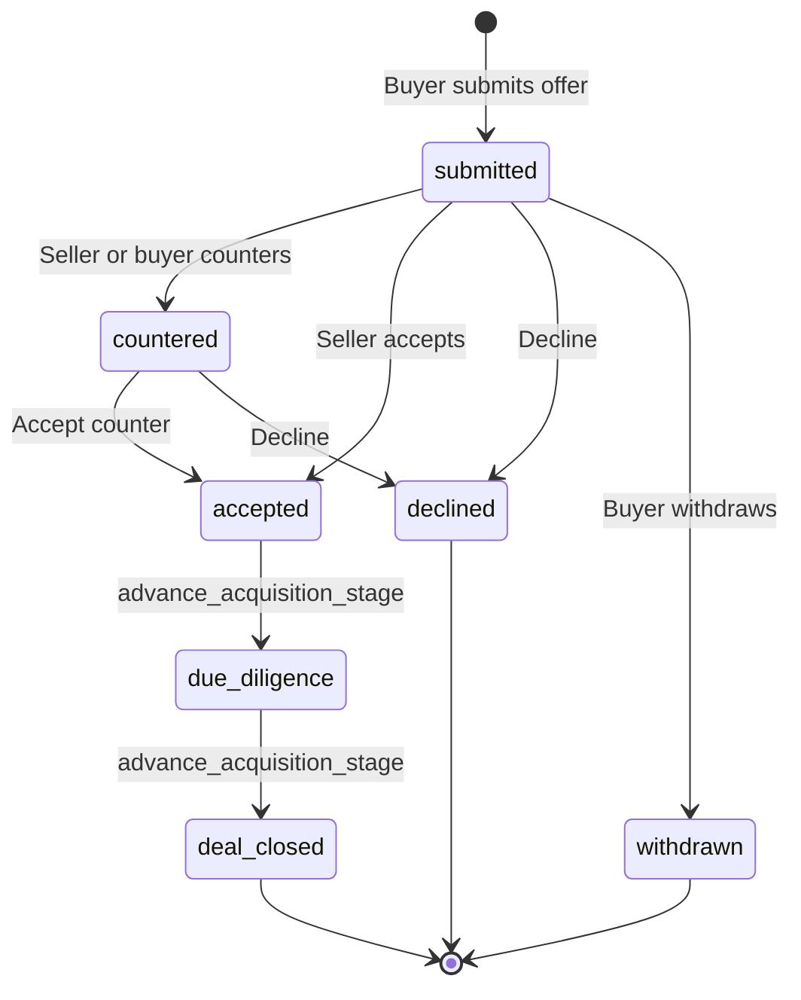

**RPC examples:** `marketplace_submit_offer`, `marketplace_counter_offer`, `marketplace_accept_offer`, `marketplace_decline_offer`, `marketplace_withdraw_offer`, `marketplace_advance_acquisition_stage`.

When an offer is declined, linked **conversations** may move to a closed state (read-only messaging in UI).

---

## Messaging and inbox

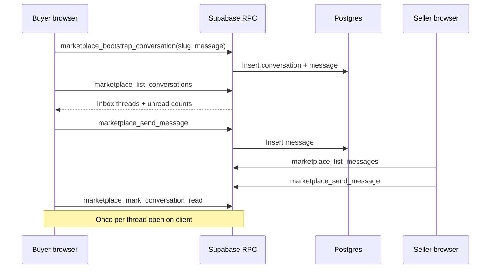

**Use cases:** Interest-led threads, offer-linked threads, seller company workspace “messages” tab where applicable.

---

## Listing verification and trust

Verification is **evidence-first**: gates (domain, revenue, business email, identity, etc.) drive lifecycle and public trust display.

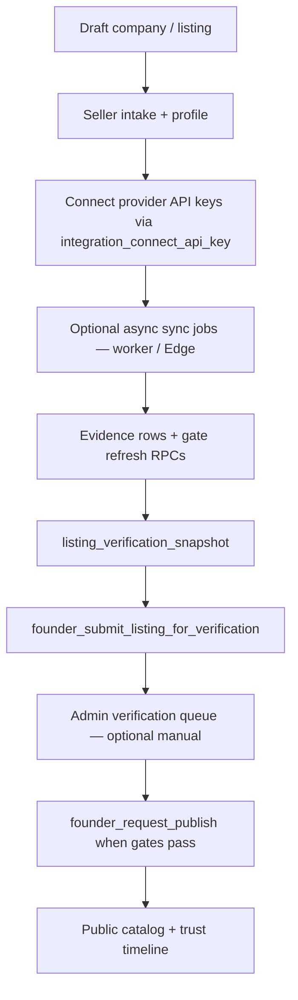

**Person verification** (buyer/seller desk): separate profile flow at `/marketplace/app/buyer/verification` and `/marketplace/app/seller/verification`.

**Stripe Identity (optional):** Webhook `POST /api/webhooks/stripe/identity` on Vercel applies identity verification results (see [`docs/architecture/automated-verification-platform.md`](docs/architecture/automated-verification-platform.md)).

---

<a id="dual-desk-same-account-two-roles"></a>

## Dual desk — same account, two roles

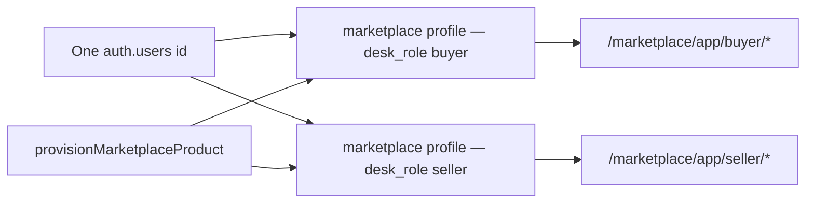

**Use case:** Founder sells one startup while also browsing as an acquirer without a second login.

---

## End-to-end deal happy path (Marketplace)

Typical acquisition flow across two users (buyer and seller). Use two browsers or incognito for a realistic pass.

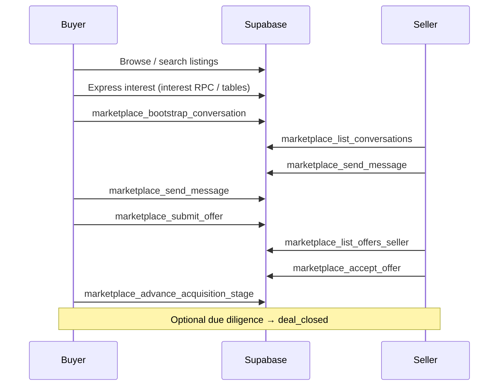

---

## Product provisioning after login

When a user enters a product app shell, the client ensures Postgres rows exist for that product and desk.

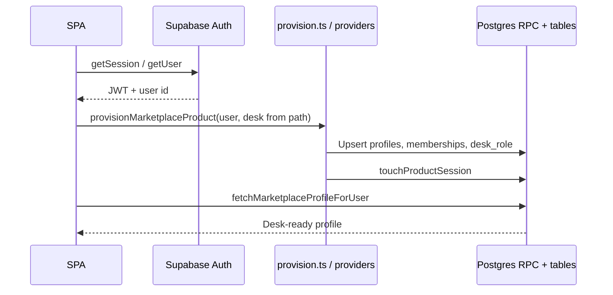

Network and Ownerr OS follow the same pattern via their providers and `ownerr_network_*` / founder RPCs.

---

## Listing lifecycle (states)

Gate-driven lifecycle (simplified; see [verification-first-listings.md](docs/architecture/verification-first-listings.md) for full rules).

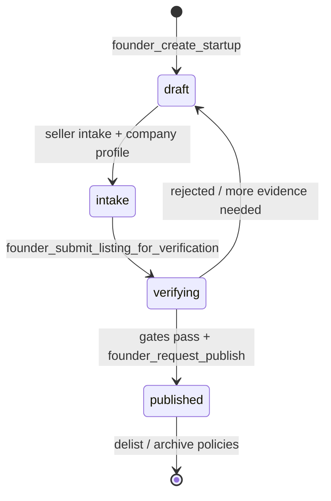

Public catalog and trust timeline update as gates accumulate evidence (revenue sync, domain DNS, business email, identity, etc.).

---

<a id="ownerr-network-member-flow"></a>

## Ownerr Network — member flow

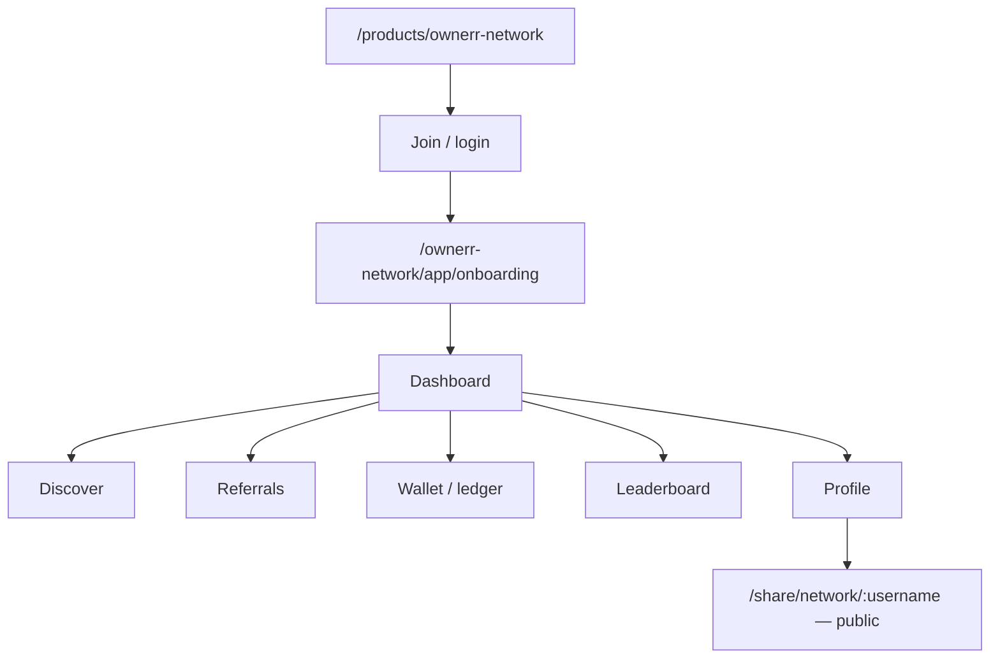

**Backend:** `ownerr_network_*` RPCs and tables (provision user, onboarding, daily activity, etc.) in [`lib/ownerr-network`](artifacts/ownerr-web-app/src/lib/ownerr-network).

---

<a id="ownerr-os-founder-flow"></a>

## Ownerr OS — founder flow

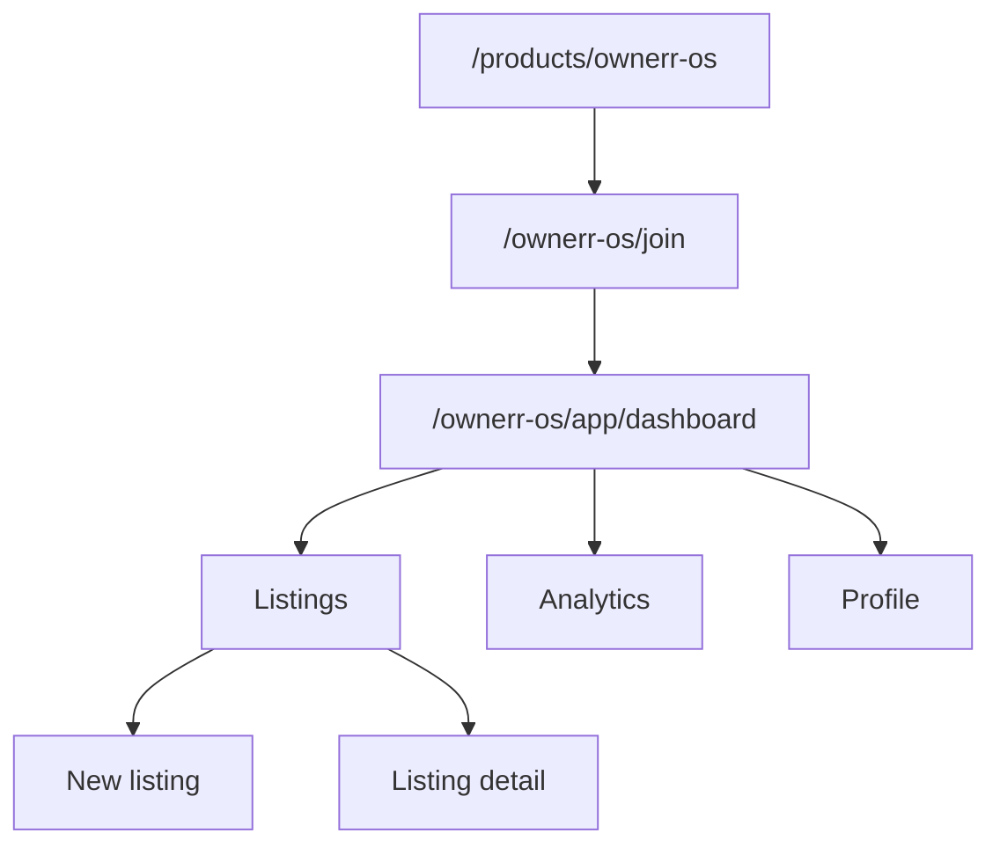

**Use case:** Founder operating system separate from marketplace seller desk (product boundaries may share auth but different app shell).

---

## Platform admin

Requires **`public.users.role = 'admin'`** (and related platform admin checks).

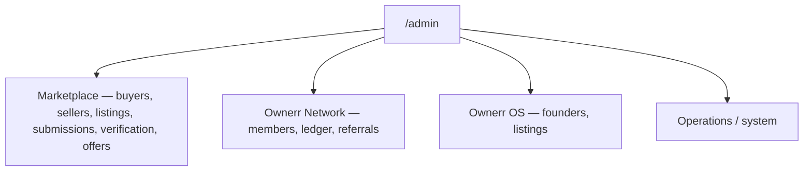

**Use cases:** Support, moderation, verification review, operational metrics (admin RPCs).

---

## Data and security model

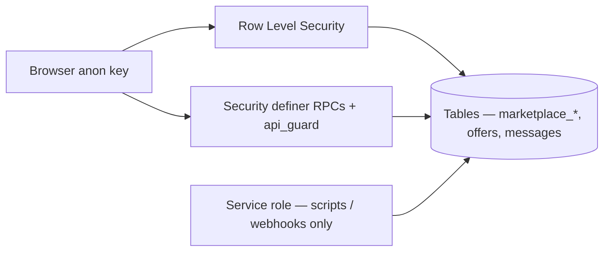

- **Seller integration keys** are encrypted in Postgres (`integration_connect_api_key`); not stored in Vercel env.
- **Platform encryption** for credentials: `npm run platform:set-integration-secrets` (requires `DATABASE_URL` locally).
- **Schema v2:** Marketplace table names may reconcile via migrations (`marketplace_accounts` vs legacy names); client uses [`dbTables`](artifacts/ownerr-web-app/src/lib/marketplace/dbTables.ts) detection.

---

## Environment and deployment

### Required environment variables

| Context | Variables |
| -------- | ----------- |
| **Vercel (production SPA)** | `VITE_SUPABASE_URL`, `VITE_SUPABASE_ANON_KEY`, `VITE_PUBLIC_SITE_URL` |
| **Local dev** | Same three in `.env.local` at repo root (Vite loads via workspace) |
| **Migration scripts** | `DATABASE_URL` or pooler URI in `.env.local` |
| **Platform admin** | `public.users.role = 'admin'` in Postgres (not a Vite env var) |

### Secrets matrix (where things live)

| Secret / config | Where | Notes |
| ---------------- | ------- | ------ |
| Supabase anon + URL | Vercel + `.env.local` | Safe in browser |
| Supabase service role | **Never** in Vite | Scripts, webhooks, worker only |
| Seller Stripe / revenue API keys | Postgres (`integration_credentials`) | Entered in UI; encrypted via `integration_connect_api_key` |
| Platform encryption key / pepper | `platform_internal_config` | `npm run platform:set-integration-secrets` |
| Stripe **Identity** webhook secret | Vercel serverless env | For `/api/webhooks/stripe/identity` |
| Sync worker invoke URLs | `platform_internal_config` or Vercel env | Optional; async verification jobs |
| Demo passwords | Seed scripts only | `demo-marketplace.constants.mjs` — not in env |

### Vercel project settings

Configure the project with **Root Directory** = `artifacts/ownerr-web-app` (or use root [`vercel.json`](vercel.json) if the project points at the monorepo root).

From [`artifacts/ownerr-web-app/vercel.json`](artifacts/ownerr-web-app/vercel.json):

| Setting | Value |
| -------- | -------- |
| Install Command | `cd ../.. && npm install` |
| Build Command | `npm run build` |
| Output Directory | `dist/public` |
| Framework | Vite |

The repo root keeps `pnpm-lock.yaml` in sync for Vercel’s post-build serverless dependency step; **do not** use `workspace:*` in `package.json` without updating the lockfile (npm install does not support that protocol).

### Migration playbook

| Action | Command | When |
| -------- | --------- | ------ |
| Apply pending SQL migrations (script) | `npm run db:migrate` | Local/CI against linked DB |
| Push via Supabase CLI | `npm run supabase:push` or `supabase db push` | When CLI project is linked |
| Link CLI | `npm run supabase:link` | One-time per machine |
| Schema v2 cutover helper | `npm run schema-v2:cutover` | Rare; generates + applies cutover migration |

Always apply migrations to **staging before production**. Partial applies are recovered with reconcile migrations under `supabase/migrations/` (see [schema-v2.md](docs/architecture/schema-v2.md)). There is no automatic down-migration.

### Webhook and Edge checklist (production)

| Integration | Endpoint / deploy | Purpose |
| ------------- | ------------------- | -------- |
| Stripe Identity | `POST https://<site>/api/webhooks/stripe/identity` | Apply identity verification results |
| Auth email (optional) | Supabase Edge `send-auth-email` | `npm run supabase:deploy-auth-email` |
| Verification jobs (optional) | `/api/sync-worker/...` proxy or Edge invoke URL | Revenue/domain async sync |

If async URLs are unset, seller **desk** flows still work; launch/sync RPCs return `configured: false` where documented.

Install from **monorepo root**:

```bash
npm install
```

Full production model: [`docs/architecture/production-supabase-baas.md`](docs/architecture/production-supabase-baas.md).

---

## Local development

From repository root:

```bash
npm install
cp .env.example .env.local   # fill Supabase keys
npm run db:migrate           # apply migrations to linked project
npm run dev                  # Vite — artifacts/ownerr-web-app
```

**With verification worker (local only):**

```bash
npm run dev:with-verification-worker
```

**Quality gate:**

```bash
npm run check    # typecheck + format:check + lint
npm run build
```

**Smoke / integration (needs `.env.local` + DB):**

```bash
npm run test:verification   # verification-automation tests + integration/smoke scripts
npm run seed:marketplace-qa # QA company for desk smoke
# Desk smoke runs as part of test:verification (marketplace-desk.smoke.mjs)
```

See also [docs/local-verification.md](docs/local-verification.md) (no GitHub Actions CI in this repo during active development).

### Production smoke (manual)

After each deploy to production:

1. Public page loads: `/` and `/marketplace/acquire`
2. Buyer login → inbox → open **one** thread → Network tab: **at most one** `marketplace_mark_conversation_read` per open (no PATCH storm)
3. Send one message → appears without hundreds of duplicate RPCs
4. Seller login → reply on same thread
5. Optional: submit/accept offer on a test listing
6. Admin hub loads for an admin user

---

**Web app only** (from `artifacts/ownerr-web-app`):

```bash
npm run dev
npm run typecheck
npm run lint
npm run build
```

---

<a id="client-supabase-map"></a>

## Client ↔ Supabase map

| Concern | Location in repo |
| -------- | ----------------- |
| Inbox, messages, mark-read | [`messageService.ts`](artifacts/ownerr-web-app/src/lib/marketplace/messageService.ts), [`useInbox.ts`](artifacts/ownerr-web-app/src/hooks/marketplace/useInbox.ts) |
| Offers | [`offerService.ts`](artifacts/ownerr-web-app/src/lib/marketplace/offerService.ts), [`useOffers.ts`](artifacts/ownerr-web-app/src/hooks/marketplace/useOffers.ts) |
| Profiles / dual desk | [`profiles.ts`](artifacts/ownerr-web-app/src/lib/marketplace/profiles.ts), [`MarketplaceProvider.tsx`](artifacts/ownerr-web-app/src/context/marketplace/MarketplaceProvider.tsx), [`syncMarketplaceDeskRole.ts`](artifacts/ownerr-web-app/src/lib/auth/syncMarketplaceDeskRole.ts) |
| Listing verification UI | [`listingVerificationApi.ts`](artifacts/ownerr-web-app/src/lib/intelligence/listingVerificationApi.ts), `ListingVerificationHub.tsx` |
| Table name v1/v2 | [`dbTables.ts`](artifacts/ownerr-web-app/src/lib/marketplace/dbTables.ts) |
| RPC telemetry (admin/search) | [`rpcTelemetry.ts`](artifacts/ownerr-web-app/src/lib/api/rpcTelemetry.ts), [`marketplaceApi.ts`](artifacts/ownerr-web-app/src/lib/api/marketplaceApi.ts) |
| RPC fallback policy | [`postgrestRpc.ts`](artifacts/ownerr-web-app/src/lib/marketplace/postgrestRpc.ts) — no double REST fallback on 400/403 |
| Routes / guards | [`routeRegistry.ts`](artifacts/ownerr-web-app/src/routing/routeRegistry.ts), `RouteGuard`, `DeskRoleGuard` |

Prefer **RPCs** for marketplace desk writes; direct PostgREST reads are fallbacks when RPCs are missing (`PGRST202`), not when RPC returns client errors.

---

## Errors and RPC fallbacks

- User-facing errors often map from PostgREST via [`mapSupabaseError`](artifacts/ownerr-web-app/src/lib/marketplace/errors.ts) → `MarketplaceError`.
- **`postgrestRpc.shouldSkipDirectTableFallback`**: if an RPC exists but returns 400/401/403, the client does **not** also hammer table PATCH/SELECT (prevents duplicate load).
- Inbox **mark-read** runs once per conversation open; mutations do not invalidate queries in a loop (see `useMarkConversationRead`).
- If production shows repeated `marketplace_mark_conversation_read` 400s, fix the RPC/RLS in Supabase — the client will not spam PATCH after the guard.

---

## Observability

| Mechanism | Behavior |
| --------- | ---------- |
| Production browser console | Minimal branding only (`initProductionConsole`) — no dev provision spam |
| Structured dev logs | [`structuredLog.ts`](artifacts/ownerr-web-app/src/lib/observability/structuredLog.ts), [`devLog.ts`](artifacts/ownerr-web-app/src/lib/observability/devLog.ts) gated in prod |
| PostHog | Optional `VITE_POSTHOG_*` in [`.env.example`](.env.example) |
| `api_log_client_request` | Fired from `instrumentedRpc` in **development only** (not doubled in prod) |

---

## Schema v2 (marketplace)

Postgres may use v2 physical names (`marketplace_accounts`, `marketplace_conversations`, …) while older clients expected legacy names. Migrations under `supabase/migrations/` reconcile views/helpers; the SPA detects active tables at runtime via `ensureMarketplaceTablesDetected()`. Details: [schema-v2.md](docs/architecture/schema-v2.md).

---

## Feature matrix (by surface)

| Capability | Public | Buyer | Seller | Admin | Notes |
| ----------- | :----: | :---: | :----: | :---: | ------ |
| Browse / startup detail | ✓ | ✓ | ✓ | ✓ | Search RPC where enabled |
| Express interest | | ✓ | | | |
| Inbox / messaging | | ✓ | ✓ | | RPC + bounded poll |
| Offers pipeline | | ✓ | ✓ | ✓ | Decline closes thread UI |
| Bids | | ✓ | | | Where listing supports bids |
| Person verification | | ✓ | ✓ | | |
| Listing verification hub | | | ✓ | ✓ | Gates + provider connect |
| Revenue/domain async sync | | | ✓ | | Optional worker/Edge |
| Valuation (public tool) | ✓ | | | | `/valuation` |
| Ownerr Network app | | | | | Separate product shell |
| Ownerr OS app | | | | | Separate product shell |
| Platform admin CRUD | | | | ✓ | `users.role = admin` |

---

## Contributing

1. Branch from `main` (or your team’s default).
2. Run `npm run check` and `npm run build` at repo root before pushing.
3. **Routes:** add paths to `routeRegistry.ts` and wire in `App.tsx` — avoid orphan URLs.
4. **Backend behavior:** add RPCs + RLS in `supabase/migrations/`; update [api-catalog.md](docs/architecture/api-catalog.md) when adding public RPC contracts.
5. **Client calls:** prefer thin hooks + service modules under `src/lib/marketplace/` or `src/lib/api/`.
6. Do not commit `artifacts/ownerr-web-app/api/**/*.js` (tsc emit); Vercel compiles `/api` from TypeScript — see [`api/tsconfig.json`](artifacts/ownerr-web-app/api/tsconfig.json).

---

## Known limitations

- **`artifacts/api-server`** is legacy; not used for production marketplace desk.
- **Mockup sandbox** workspace is for UI experiments, not production flows.
- **Large JS chunks** (valuation PDF, charts) — see [bundle-lazy-load-candidates.md](docs/bundle-lazy-load-candidates.md).
- **Realtime** for messages may be added later; current inbox uses polling with conservative intervals.
- **GitHub Actions CI** is not enabled; rely on local `npm run check` and optional `test:verification`.
- Deprecated admin route aliases remain in `ADMIN_ROUTES` for bookmarks.

---

## Troubleshooting

| Symptom | Likely cause | What to do |
| -------- | ------------- | ----------- |
| Vercel `EUNSUPPORTEDPROTOCOL workspace:*` | npm install on `workspace:*` deps | Use `*` for workspace packages + root `npm install`; keep `pnpm-lock.yaml` in sync |
| Vercel `pnpm-lock.yaml` out of date | Root `package.json` changed without lockfile | `pnpm install --lockfile-only` at repo root, commit lockfile |
| `identity.js` vs `identity.ts` conflict on Vercel | Committed emitted JS under `api/` | Delete `api/**/*.js`; `api/tsconfig.json` uses `noEmit: true` |
| Inbox API storm / `ERR_INSUFFICIENT_RESOURCES` | Old client looping mark-read | Deploy latest; one RPC per thread open |
| RPC 400 on mark-read | DB function / `api_guard` / RLS | Fix migration; client won’t PATCH-loop |
| Empty inbox with interests | Missing conversation rows | Run repair RPC once; check `marketplace_repair_buyer_interest_conversations` |
| Seller key connect fails | Missing platform encryption config | `npm run platform:set-integration-secrets` |
| Migrations fail mid-way | Partial DB | Apply reconcile migrations; see schema-v2 docs |

---

## Key marketplace routes (reference)

| Area | Path prefix |
| ------ |-------------|
| Public acquire | `/marketplace/acquire`, `/marketplace/startup/:slug` |
| Buyer desk | `/marketplace/app/buyer/dashboard`, `.../browse`, `.../inbox`, `.../offers`, `.../verification` |
| Seller desk | `/marketplace/app/seller/dashboard`, `.../companies`, `.../inbox`, `.../offers`, `.../verification` |
| Admin | `/admin`, `/admin/marketplace/*`, `/admin/ownerr-network/*`, `/admin/ownerr-os/*` |

---

## Architecture docs (detail)

| Document | Contents |
| -------- | -------- |
| [production-supabase-baas.md](docs/architecture/production-supabase-baas.md) | Deploy model, env vars |
| [api-catalog.md](docs/architecture/api-catalog.md) | RPC inventory by domain |
| [marketplace-offers-platform.md](docs/architecture/marketplace-offers-platform.md) | Offers design |
| [verification-first-listings.md](docs/architecture/verification-first-listings.md) | Listing lifecycle + gates |
| [automated-verification-platform.md](docs/architecture/automated-verification-platform.md) | Worker, webhooks, Stripe |
| [schema-v2.md](docs/architecture/schema-v2.md) | Marketplace schema evolution |
| [supabase/README.md](supabase/README.md) | Supabase project ops |

---

## Tech stack

- **UI:** React 19, TypeScript, Wouter, TanStack Query, Tailwind CSS v4, Radix UI
- **Backend:** Supabase Auth, Postgres, PostgREST, RPCs, RLS
- **Deploy:** Vercel (static + optional `/api` serverless)
- **Tooling:** npm workspaces, Vite 7, ESLint, Prettier, TypeScript project references

---

## Demo accounts (after seed)

| Desk | Email | Password (default in seed script) |
| ------ | ------- | ----------------------------------- |
| Buyer | `demo-buyer@marketplace.app` | `DemoBuyer123!` |
| Seller | `demo-seller@marketplace.app` | `DemoSeller123!` |

Seeded seller listing slugs (when present): `stan`, `sorio-ai`, `rezi`.

---

## Export Mermaid diagrams

For slides or Confluence:

```bash
npx @mermaid-js/mermaid-cli -i diagram.mmd -o diagram.png
```

Paste any ` ```mermaid ` block from this file into a `.mmd` file first.
