# Ownerr Web App

Ownerr is a frontend-first startup acquisition marketplace simulation at `artifacts/ownerr-web-app`.  
It models discovery, trust evaluation, interest threads, mock bidding, and role-based buyer/founder dashboards.

## What It Is

- A React + TypeScript application for marketplace-style startup acquisition workflows
- Mock-authenticated and role-aware (`buyer`, `founder`)
- Fully local persistence using IndexedDB + LocalStorage
- No real backend in active user flows (service layer is mock/domain-driven)

## What It Does

- Public discovery: browse and inspect startup listings
- Buyer operations: filter/search, express interest, place bids, track interests and bids
- Founder operations: monitor listings, respond to inbox threads, adjust verification state
- Trust model: computed trust score/label from verification states
- Deal simulation: stage progression across a mock bidding pipeline

---

## 1) System Architecture (Full)
Shows the implemented layers and end-to-end data movement.

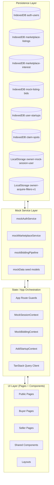

---

## 2) Component Architecture
High-level relationships between pages, layouts, and shared/domain components.

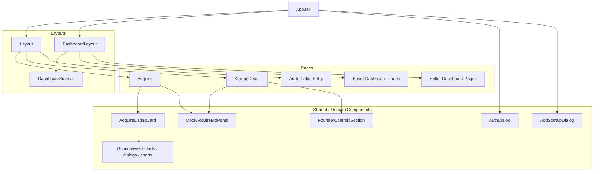

---

## 3) Routing Flow
Separates public vs protected routes and captures implemented redirect behavior.

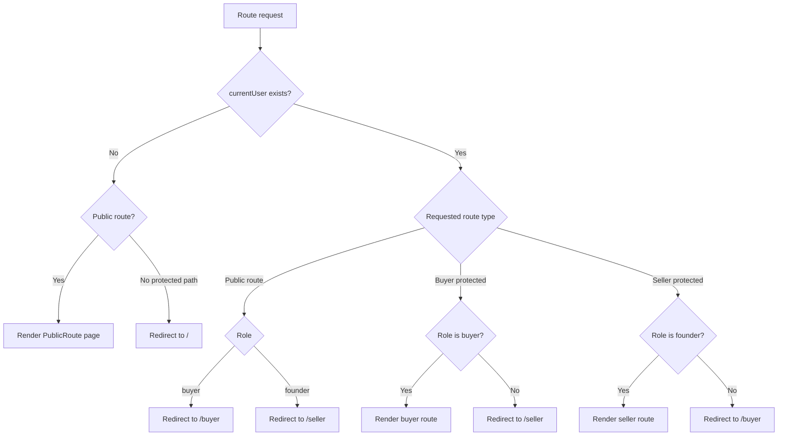

Implemented route groups:
- Public: `/`, `/feed`, `/stats`, `/cofounders`, `/claim`, `/startup/:slug`, `/founder/:handle`, `/acquire`
- Buyer: `/buyer`, `/buyer/interests`, `/buyer/acquire`, `/buyer/bids`, `/buyer/profile`
- Seller: `/seller`, `/seller/listings`, `/seller/inbox`, `/seller/verification`, `/seller/profile`

---

## 4) Authentication Flow (Mock)
Shows guest entry, auth dialog behavior, persistence, and guarded routing effects.

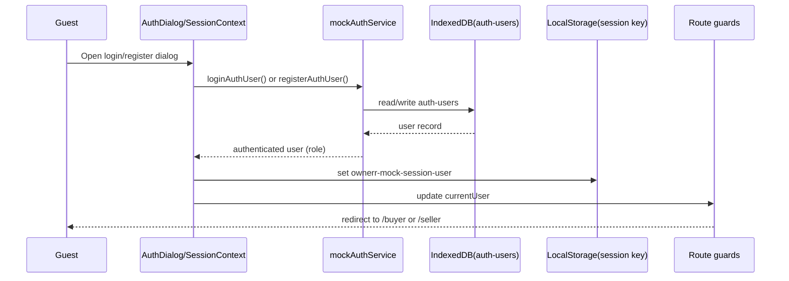

Notes:
- There are no standalone `/login` or `/register` routes; auth is modal-based.
- On app load, session is rehydrated from LocalStorage and user record is loaded from IndexedDB.

---

## 5) Buyer User Flow
Implemented buyer path from exploration to conversation/bid tracking.

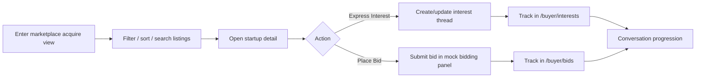

---

## 6) Seller (Founder) User Flow
Implemented founder journey across dashboard, listing control, verification, and thread handling.

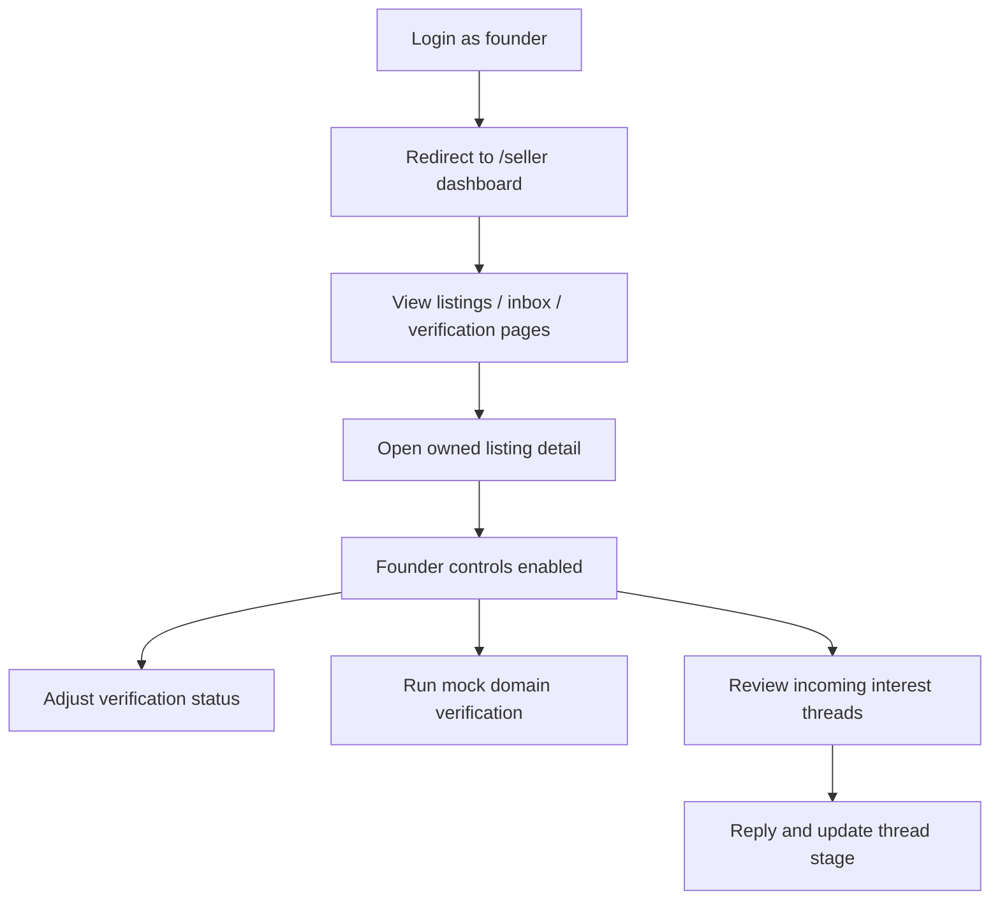

Note: a strict `Draft -> Publish` state machine is not fully implemented as a dedicated listing status model.

---

## 7) Listing Lifecycle Flow
Represents lifecycle states that are actually implemented today.

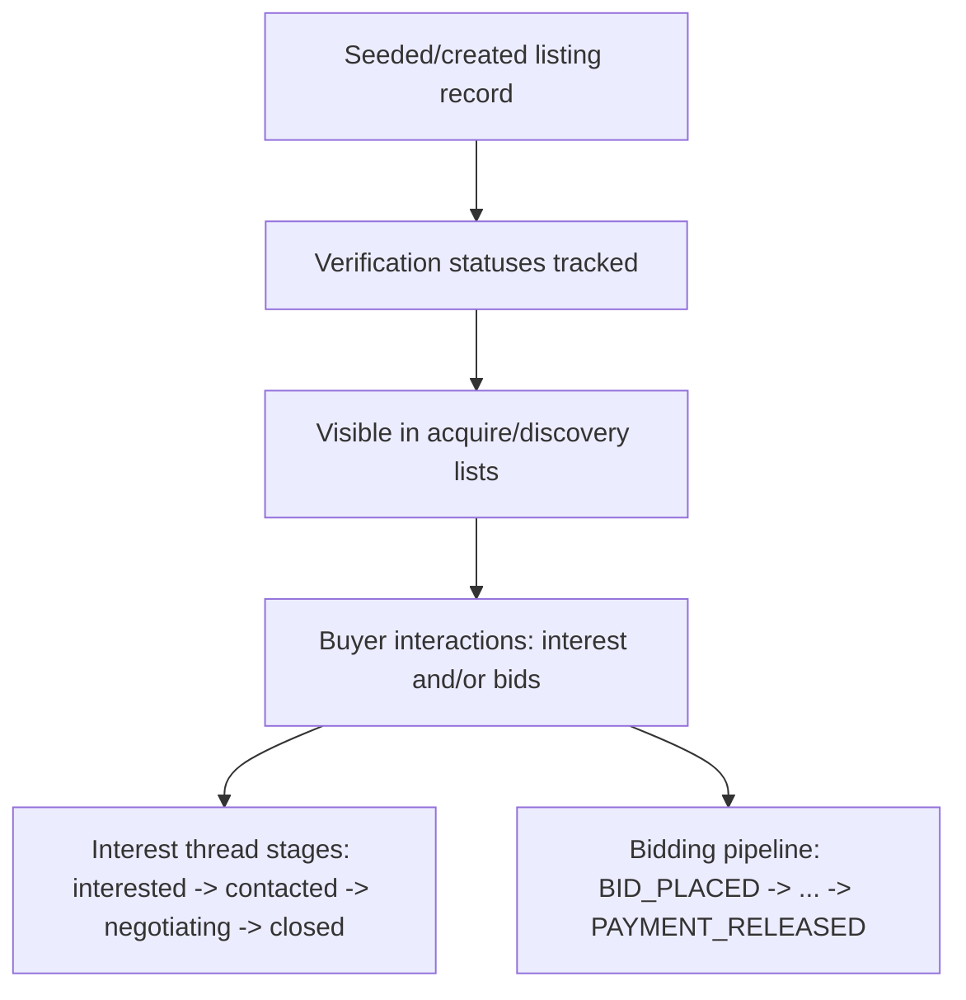

Notes:
- `forSale` controls market behavior; no dedicated publish-state enum.
- Interest stages and bidding pipeline are separate but related lifecycle tracks.

---

## 8) Verification Flow
Covers revenue, domain, and traffic verification logic with implemented transitions.

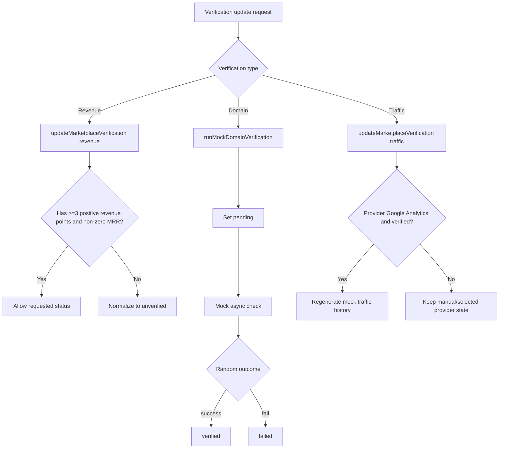

---

## 9) Data Flow Diagram
Shows how each core entity moves through UI, services, persistence, and back.

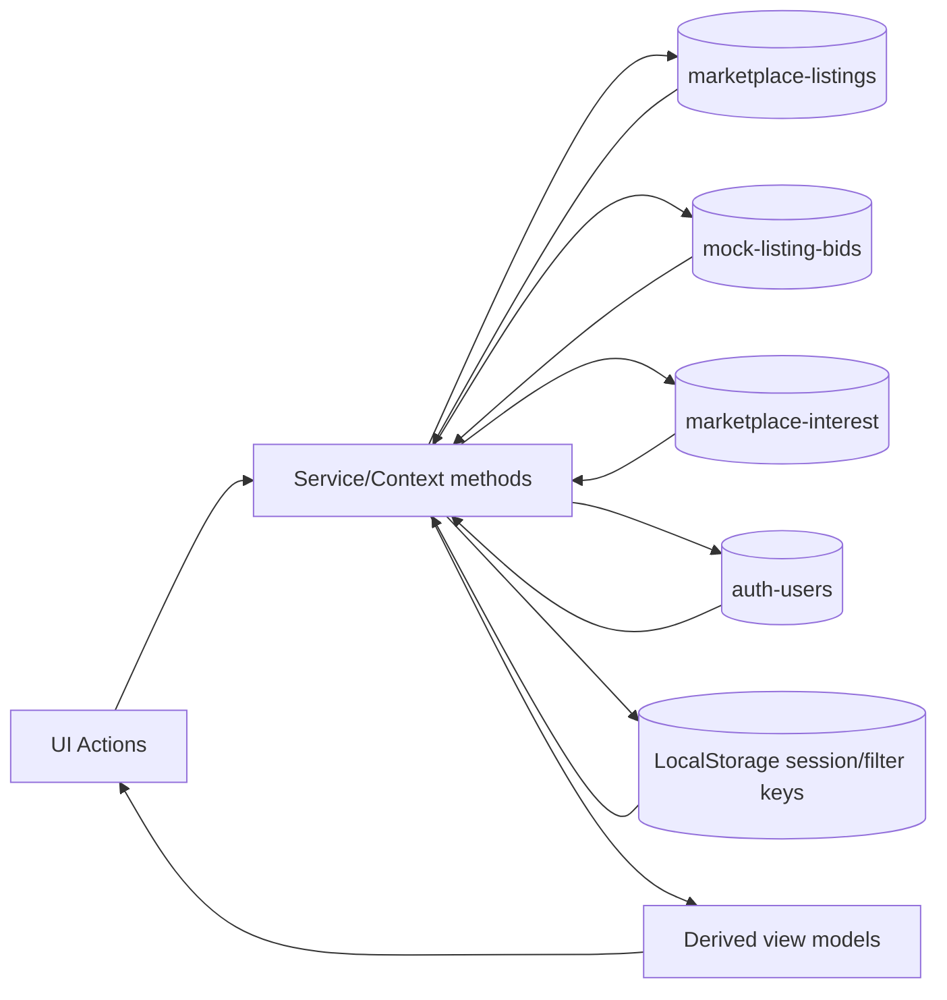

Entity mapping:
- Listings: `MarketplaceListing` via `mockMarketplaceService`
- Bids: `MockListingBidRecord` via `MockBiddingContext`
- Interest threads/messages: `MarketplaceInterestRecord`
- Auth/session: auth user records + session user id key

---

## 10) Trust Score Computation
Exact implemented weighting logic used to derive `trustScore` and labels.

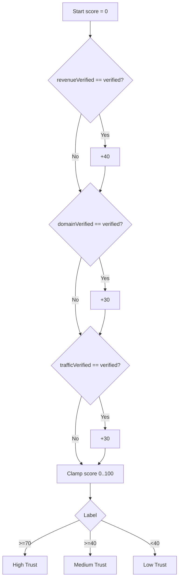

---

## 11) Dashboard Flows
Shows current buyer and seller dashboard navigation and intent.

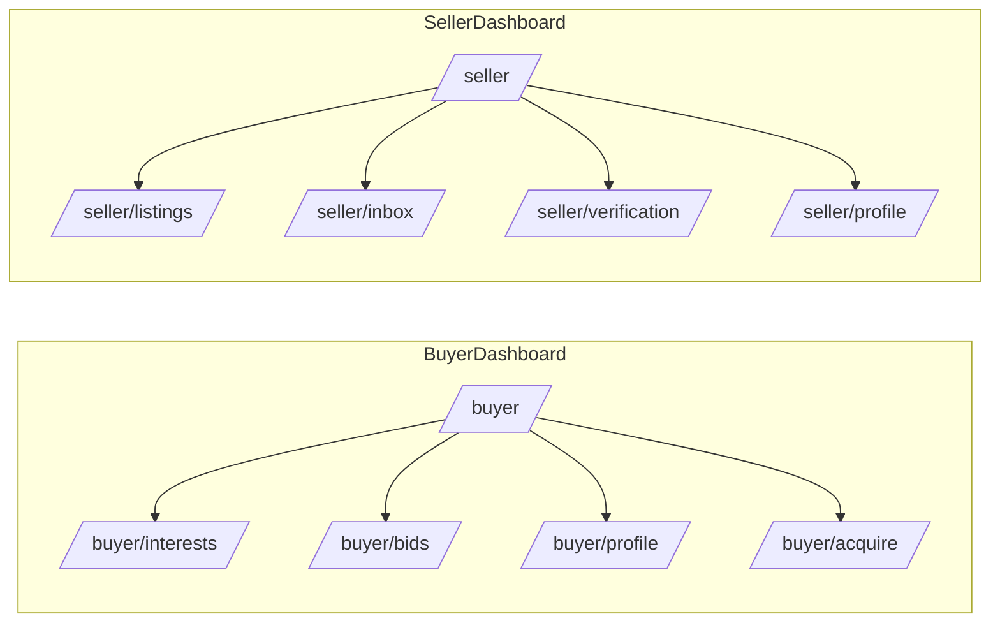

---

## 12) Error / Edge Flow (Lightweight)
Summarizes implemented guardrails and common edge conditions.

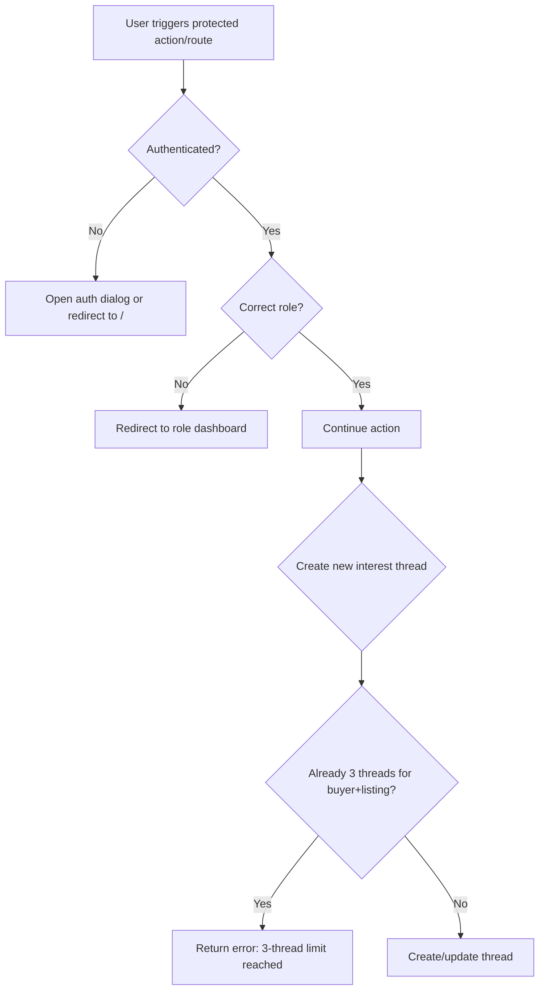

---

## Key Features (Concise)

- Public startup discovery and listing detail experiences
- Modal-based mock authentication with role-aware redirects
- Buyer and seller dashboard ecosystems with route guards
- Mock verification and trust scoring engine
- Interest thread lifecycle and mock bidding/deal pipeline
- Browser-local persistence for realistic state continuity

---

## Tech Stack

- Frontend: React 19, TypeScript, Wouter, TanStack Query, Tailwind CSS v4
- UI: Radix-based primitives, Lucide icons, Framer Motion, Recharts
- Data/persistence: IndexedDB (`idb`) + LocalStorage
- Tooling: Vite, TypeScript (`tsc`), static deployment config via Vercel

---

## Project Structure

`artifacts/ownerr-web-app`

- `src/App.tsx` - providers, routing, public/protected wrappers
- `src/pages/` - public, buyer, seller page modules
- `src/components/` - shared and domain components
- `src/context/` - session, bidding, and listing-related providers
- `src/lib/` - mock services, persistence adapters, domain models, utilities

---

## Run Locally

From `artifacts/ownerr-web-app`:

```bash
npm install
npm run dev
```

Additional scripts:

```bash
npm run build
npm run serve
npm run typecheck
```

---

## Constraints

- Frontend-only mock implementation for core flows
- No server-backed multi-user synchronization
- Verification and closing pipeline behavior are simulated
- No dedicated backend ACL enforcement (client-side route/component guards)

---

## Optional: Export Diagrams for Sharing

For external docs/slides, export Mermaid blocks to PNG/SVG using Mermaid CLI:

```bash
npx @mermaid-js/mermaid-cli -i diagram.mmd -o diagram.png
```
