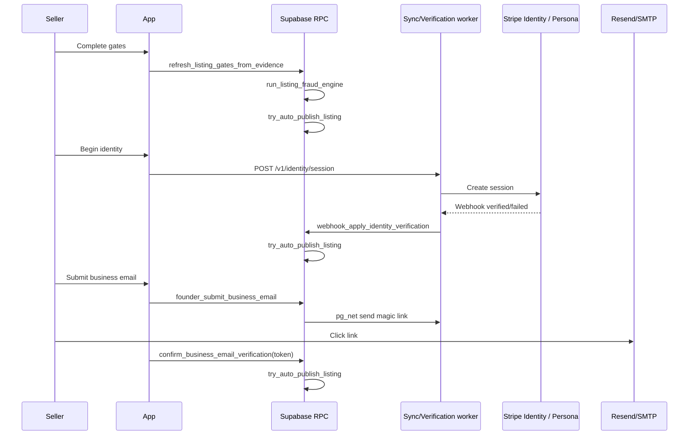

# Automated verification platform

Evolution of [verification-first-listings.md](./verification-first-listings.md): **no manual admin approval** on the standard path. Admins handle **fraud** (`warning` / `high_risk`) and escalations only.

**Architecture:** The web app’s default production stack is **Supabase BaaS + Vercel static** ([production-supabase-baas.md](./production-supabase-baas.md)). Marketplace buyer/seller does not use a separate backend. Async verification (Stripe, Resend, OCR) is optional and can use Supabase Edge Functions or same-origin `/api` on Vercel — not a required second server.

## Audit summary (pre-automation)

| Area           | Before                                 | Change                                                            |
| -------------- | -------------------------------------- | ----------------------------------------------------------------- |
| Publish        | Seller clicks publish after `verified` | **`try_auto_publish_listing`** when all gates pass                |
| Identity       | Admin `admin_review_identity`          | **Provider session + webhook** (`identity_verification_sessions`) |
| Business email | `manual_review` + admin                | **Magic link** + consumer-domain blocklist                        |
| Registration   | Admin document approve                 | **OCR completion RPC** + confidence threshold                     |
| Admin queue    | All open reviews                       | **`admin_fraud_investigation_queue`** only                        |
| Lifecycle      | `verification_review` common           | **`verification_in_progress`** until auto-publish or `failed`     |

## Event-driven flow



## Migration

Apply **`20260702190000_automated_verification_platform.sql`** after `20260702180000`.

## Worker endpoints (same HTTP server as sync worker)

| Method | Path                                    | Auth                        | Purpose                                                                          |
| ------ | --------------------------------------- | --------------------------- | -------------------------------------------------------------------------------- |
| POST   | `/api/webhooks/stripe/identity`         | Stripe signature            | Apply identity result (canonical; also `/v1/webhooks/identity/stripe` on worker) |
| POST   | `/v1/identity/session`                  | Bearer cron or launch token | Create Stripe Identity session                                                   |
| POST   | `/v1/verification/send-business-email`  | Bearer cron secret          | Send magic link email                                                            |
| POST   | `/v1/verification/process-registration` | Bearer cron secret          | Run OCR + `complete_registration_verification`                                   |

Env: `STRIPE_SECRET_KEY`, `STRIPE_IDENTITY_WEBHOOK_SECRET`, `RESEND_API_KEY`, `MARKETPLACE_PUBLIC_URL`, `VERIFICATION_OCR_PROVIDER` (optional).

**Production URLs (main domain only):**

- Stripe webhook: `https://ownerr.live/api/webhooks/stripe/identity`
- Revenue / domain jobs + identity launch (browser + pg_net): `https://ownerr.live/api/sync-worker/v1/...` (Vercel proxies to private `SYNC_WORKER_INTERNAL_URL`)

**Local:**

- `stripe listen --forward-to http://localhost:5173/api/webhooks/stripe/identity`
- Vite proxies `/api/sync-worker` and `/api/webhooks` to sync worker `:8787`

## Gates (all required for auto-publish)

1. **Identity** — `identity_verification_sessions.status = verified` (latest)
2. **Domain** — existing DNS worker → `domain_status = verified`
3. **Business email** — token confirmed; domain = verified domain; not consumer domain
4. **Revenue** — `revenue_status = verified`, `verified_revenue_amount > 0`, and a successful provider sync within the configured freshness window (default 30 days), from normalized `verified_revenue_metrics` (any supported revenue class: subscription, transaction, commerce, accounting, banking).

Live smoke (all 18 revenue providers, real HTTP — no mocked revenue):

```bash
npm run test:revenue-providers
# Require credentials for every provider (fail if any missing):
REVENUE_SMOKE_STRICT=1 npm run test:revenue-providers
```

Uses seller-desk `integration_connections` secrets when present, else `REVENUE_SMOKE_*` vars in `.env.local` (see `.env.example`). 5. **Registration** — `registration_status = verified` (OCR confidence ≥ threshold)

**Auto-publish blocked** when `fraud_risk = high_risk`. `warning` opens admin fraud ticket but does not block publish.

## Trust

Continues to use **`recompute_listing_trust_v2`** (evidence-only weights).

## App

- Seller: no “Publish” button; lifecycle banner explains auto-publish
- Public: `/marketplace/verify-business-email?token=…` confirms email
- Identity: redirect to provider URL from `founder_begin_identity_verification`
