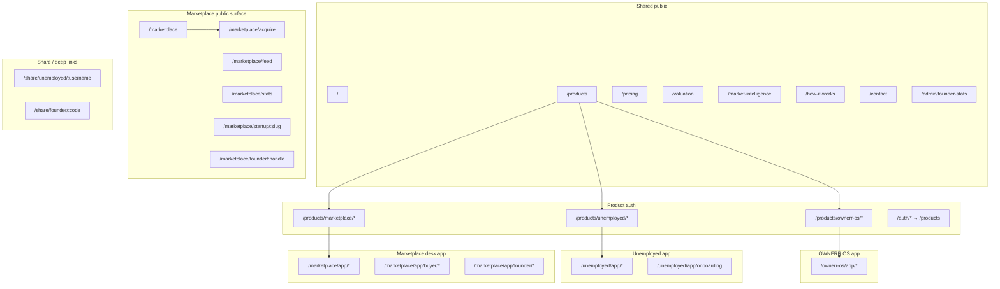

# Navigation & routing architecture audit

**Date:** 2026-05-26  
**Scope:** `artifacts/ownerr-web-app`  
**Status:** Phase 1 complete — **no refactor implemented** (planning document for Phases 2–10)

---

## Executive summary

The app has **two parallel routing systems**:

| Layer              | Location                                   | Role                         |
| ------------------ | ------------------------------------------ | ---------------------------- |
| **Runtime routes** | `src/App.tsx` (wouter `Switch`)            | What actually renders        |
| **Metadata**       | `src/routing/routeRegistry.ts` + resolvers | Access rules, sidebars, docs |

They are **not fully synchronized**. Auth paths are **hardcoded in `App.tsx`** while partial constants live in `PRODUCT_AUTH_ROUTES`.

**Product isolation** (post-refactor) uses:

- `AuthContext` — session only
- `ActiveProductContext` — `sessionStorage` active app (`ownerr_os` \| `marketplace` \| `unemployed`)
- `ProductShellEnforcer` — signed-in users confined to **one product’s `/app` tree**
- `RouteGuard` + `DeskRoleGuard` / `UnemployedProtectedRoute` — per-route checks

**Critical UX conflict:** Signed-in users with an active product **cannot use public marketplace URLs** (`/marketplace`, `/marketplace/acquire`, `/marketplace/startup/:slug`, etc.). `ProductShellEnforcer` redirects them to the product dashboard. Meanwhile the **marketplace app sidebar** links many items to those public paths → **effective dead navigation** when logged in.

**Marketplace positioning:** Runtime treats marketplace as **public discovery surface** (`/marketplace/*`) plus **authenticated desk** (`/marketplace/app/*`). It is **not** listed in `PRODUCT_ITEMS` (hub shows OWNERR OS + Unemployed only). Landing `/products/marketplace` redirects to `/marketplace`.

---

## App ownership model (target)

| Domain                                 | Meaning                                                  | Path prefix examples                          |
| -------------------------------------- | -------------------------------------------------------- | --------------------------------------------- |
| **Shared public**                      | Marketing, tools, legal, hub                             | `/`, `/products`, `/pricing`, `/valuation`, … |
| **Marketplace (surface)**              | Public browse — **not a “product app” in hub**           | `/marketplace`, `/marketplace/acquire`, …     |
| **OWNERR OS (product)**                | Founder viral / desk                                     | `/products/ownerr-os`, `/ownerr-os/app/*`     |
| **Unemployed (product)**               | Network product                                          | `/products/unemployed`, `/unemployed/app/*`   |
| **Marketplace desk (product session)** | Buyer/founder workspace when `activeProduct=marketplace` | `/marketplace/app/*`                          |
| **Shared auth**                        | Per-product login/register/callback                      | `/products/{slug}/login`, …                   |
| **Legacy auth**                        | Redirect only                                            | `/auth/*` → `/products`                       |

---

## High-level route graph (runtime)



---

## Runtime route inventory (`App.tsx`)

For each route: **component**, **ownership**, **auth**, **onboarding**, **nav entry**, **issues**.

### Shared public

| Path                   | Component          | Auth | Onboarding | Primary nav entry                            | Issues                                                                        |
| ---------------------- | ------------------ | ---- | ---------- | -------------------------------------------- | ----------------------------------------------------------------------------- |
| `/`                    | `landing`          | No   | —          | Marketing nav, logo                          | Signed-in + active product → **shell may redirect away** if user lands here   |
| `/products`            | `products`         | No   | —          | Header CTAs, footer                          | **App picker** (not full AppResolver); no marketplace card in `PRODUCT_ITEMS` |
| `/pricing`             | `pricing`          | No   | —          | `NAV_ITEMS`                                  | OK                                                                            |
| `/valuation`           | `valuation` (lazy) | No   | —          | Marketing, sidebar link from marketplace app | **Broken when signed in** (shell redirect)                                    |
| `/market-intelligence` | lazy               | No   | —          | Marketing                                    | Same if signed in                                                             |
| `/how-it-works`        | `how-it-works`     | No   | —          | `NAV_ITEMS`                                  | OK                                                                            |
| `/contact`             | `contact`          | No   | —          | `NAV_ITEMS`, footer                          | OK                                                                            |
| `/admin/founder-stats` | lazy               | No\* | —          | None (URL only)                              | \*No route guard; obscurity only                                              |

### Product landings

| Path                    | Component                 | Auth | Nav entry                |
| ----------------------- | ------------------------- | ---- | ------------------------ |
| `/products/ownerr-os`   | `products/ownerr-os`      | No   | Products hub, dropdown   |
| `/products/unemployed`  | `products/unemployed`     | No   | Products hub, dropdown   |
| `/products/marketplace` | Redirect → `/marketplace` | No   | **Not in PRODUCT_ITEMS** |

### Product auth (strings in App — not all in `PRODUCT_AUTH_ROUTES`)

| Path                                                               | Component                               | Notes                        |
| ------------------------------------------------------------------ | --------------------------------------- | ---------------------------- |
| `/products/ownerr-os/login\|register\|callback\|forgot-password`   | `ProductAuthScreen` / callback / forgot | Callback sets active product |
| `/products/marketplace/login\|register\|callback\|forgot-password` | same                                    |                              |
| `/products/unemployed/login\|register\|callback\|forgot-password`  | same                                    |                              |
| `/auth/*`                                                          | Redirect `/products`                    | Legacy                       |

### OWNERR OS (`/ownerr-os/app/*`)

| Path                       | Component                     | Auth        | Onboarding | Sidebar |
| -------------------------- | ----------------------------- | ----------- | ---------- | ------- |
| `/ownerr-os/app`           | `ownerr-os/app/index`         | Yes + shell | —          | Index   |
| `/ownerr-os/app/dashboard` | dashboard                     | Yes         | —          | Yes     |
| `/ownerr-os/app/referrals` | referrals → re-exports `join` | Yes         | —          | Yes     |
| `/ownerr-os/app/analytics` | analytics                     | Yes         | —          | Yes     |
| `/ownerr-os/app/listings`  | listings                      | Yes         | —          | Yes     |
| `/ownerr-os/app/settings`  | settings                      | Yes         | —          | Yes     |

**Guards:** `AuthenticatedShellRoute` → `RouteGuard` → `OwnerrProvider`.

**Gap:** `RouteGuard` passes `deskUser: null` into `resolveRoleAccess` — sidebar uses real `currentUser` separately; **route-level role enforcement in RouteGuard is ineffective** for desk roles.

### Unemployed (`/unemployed/app/*`)

| Path                          | Component   | Auth | Onboarding                         | Sidebar        |
| ----------------------------- | ----------- | ---- | ---------------------------------- | -------------- |
| `/unemployed/app`             | index       | Yes  | MCQ via `UnemployedProtectedRoute` | Yes            |
| `/unemployed/app/dashboard`   | dashboard   | Yes  | Required                           | Yes            |
| `/unemployed/app/onboarding`  | onboarding  | Yes  | **Route allows incomplete**        | No (by design) |
| `/unemployed/app/referrals`   | referrals   | Yes  | Required                           | Yes            |
| `/unemployed/app/wallet`      | wallet      | Yes  | Required                           | Yes            |
| `/unemployed/app/leaderboard` | leaderboard | Yes  | Required                           | Yes            |
| `/unemployed/app/settings`    | settings    | Yes  | Required                           | Yes            |

**Share:** `/share/unemployed/:username` — public, no App shell.

### Marketplace public (surface)

| Path                           | Component               | Auth | Nav entry                       |
| ------------------------------ | ----------------------- | ---- | ------------------------------- |
| `/marketplace`                 | `home`                  | No   | `NAV_ITEMS`, logo               |
| `/marketplace/acquire`         | `acquire` (lazy)        | No   | Home, bottom section, sidebar\* |
| `/marketplace/feed`            | `feed`                  | No   | Sidebar\*                       |
| `/marketplace/stats`           | `stats` (lazy)          | No   | Sidebar\*                       |
| `/marketplace/cofounders`      | `cofounders`            | No   | Sidebar\*                       |
| `/marketplace/claim`           | `claim-spots`           | No   | Sidebar\*                       |
| `/marketplace/startup/:slug`   | `startup-detail` (lazy) | No   | Cards, search                   |
| `/marketplace/founder/:handle` | `founder-profile`       | No   | Links                           |

\*Sidebar links **inside marketplace desk** point here but **signed-in users are redirected away** by `ProductShellEnforcer`.

### Marketplace desk (`/marketplace/app/*`)

| Path                                    | Component            | Auth | Role guard            |
| --------------------------------------- | -------------------- | ---- | --------------------- |
| `/marketplace/app`                      | Redirect → dashboard | Yes  | —                     |
| `/marketplace/app/dashboard`            | `dashboard-hub`      | Yes  | —                     |
| `/marketplace/app/settings`             | settings             | Yes  | —                     |
| `/marketplace/app/buyer`                | buyer index          | Yes  | `DeskRoleGuard` buyer |
| `/marketplace/app/buyer/bids`           | bids                 | Yes  | buyer                 |
| `/marketplace/app/buyer/interests`      | interests            | Yes  | buyer                 |
| `/marketplace/app/buyer/acquire`        | acquire (lazy)       | Yes  | buyer                 |
| `/marketplace/app/founder`              | seller index         | Yes  | founder               |
| `/marketplace/app/founder/listings`     | listings             | Yes  | founder               |
| `/marketplace/app/founder/inbox`        | inbox                | Yes  | founder               |
| `/marketplace/app/founder/profile`      | profile              | Yes  | founder               |
| `/marketplace/app/founder/verification` | verification         | Yes  | founder               |

**Guards:** `AuthenticatedShellRoute` → `MarketplaceProvider` → `RouteGuard` → optional `DeskRoleGuard`.

### Share / misc

| Path                   | Component              | Notes     |
| ---------------------- | ---------------------- | --------- |
| `/share/founder/:code` | `share/founder/[code]` | Public    |
| —                      | `not-found`            | Catch-all |

---

## Orphan / unwired page modules

Files under `src/pages/` **with no `App.tsx` route**:

| File                                                                                                                     | Notes                                             |
| ------------------------------------------------------------------------------------------------------------------------ | ------------------------------------------------- |
| `game.tsx`                                                                                                               | Unreachable                                       |
| `app-bids.tsx`                                                                                                           | Legacy redirect helper; **no route**              |
| `app-messages.tsx`                                                                                                       | Legacy redirect helper; **no route**              |
| `buyer/profile.tsx`                                                                                                      | Unwired                                           |
| `ownerr-os.tsx`                                                                                                          | Unwired                                           |
| `unemployed/index.tsx`, `login.tsx`, `dashboard.tsx`, `onboarding.tsx`, `referrals.tsx`, `wallet.tsx`, `leaderboard.tsx` | Likely **legacy paths** outside `/unemployed/app` |
| `landing.tsx`                                                                                                            | Duplicate naming; App imports `@/pages/landing`   |

**Wired only via re-export:**

- `marketplace/app/dashboard.tsx` → `dashboard-hub.tsx`
- `ownerr-os/app/referrals.tsx` → `join.tsx`

---

## Duplicate / legacy / drift

| Issue                      | Detail                                                                                                          |
| -------------------------- | --------------------------------------------------------------------------------------------------------------- |
| **Dual route sources**     | `App.tsx` vs `ROUTE_REGISTRY` (~48 defs); auth routes duplicated as string literals                             |
| **Deprecated route files** | `src/routes/appRoutes.ts`, `marketingRoutes.ts`, `marketplaceRoutes.ts`, `lib/appPaths.ts` still used in places |
| **`PRODUCT_AUTH_ROUTES`**  | Missing register/forgot-password keys; incomplete vs App                                                        |
| **`/auth/*`**              | Legacy redirects only — OK                                                                                      |
| **Marketplace landing**    | `/products/marketplace` → `/marketplace` (not a product card)                                                   |
| **FounderOsFlowDialog**    | Redirect stub to `/ownerr-os/app`; not a real modal flow                                                        |

---

## Dead ends & unreachable (by scenario)

### Signed-in + `activeProduct` set (`ProductShellEnforcer`)

| User tries                                             | Result                                                              |
| ------------------------------------------------------ | ------------------------------------------------------------------- |
| `/marketplace`, `/marketplace/acquire`, listing detail | **Redirect** to `/marketplace/app/dashboard` (or product dashboard) |
| `/valuation`, `/market-intelligence`                   | **Redirect** away from marketing tools                              |
| `/products`                                            | Allowed (hub)                                                       |
| Other product’s `/ownerr-os/app` or `/unemployed/app`  | **Redirect** to locked product dashboard                            |
| Product auth URL while session exists                  | **Redirect** to product dashboard                                   |

### Guest

| User tries                 | Result                                                                                       |
| -------------------------- | -------------------------------------------------------------------------------------------- |
| `/marketplace/app/buyer`   | `RouteGuard` → redirect to `/products/marketplace` (path uses `resolveMembershipAppForPath`) |
| `/ownerr-os/app/dashboard` | Redirect to `/products/ownerr-os` (intended)                                                 |

### Incomplete unemployed onboarding

| User tries                   | Result                    |
| ---------------------------- | ------------------------- |
| `/unemployed/app/dashboard`  | Redirect onboarding (MCQ) |
| `/unemployed/app/onboarding` | Allowed                   |

### Manual URL only

- `/admin/founder-stats`
- `/game` (404)
- Legacy `/auth/*` (redirect)

### Sidebar → public marketplace (signed-in)

Many `MARKETPLACE_SIDEBAR_SECTIONS` hrefs are **public** paths → **shell conflict** (discoverability broken without signing out or clearing active product).

---

## Auth & deep-link flows (current)

| Flow                   | Behavior                                                | Gap                                               |
| ---------------------- | ------------------------------------------------------- | ------------------------------------------------- |
| Guest → protected desk | Redirect to `/products/{app}` not login with return URL | **No intended-route restore** in `RouteGuard`     |
| Login                  | Product auth pages; callback provisions                 | Return URL partial via product auth helpers       |
| Logout                 | Clears active product                                   | Current route may still be invalid until redirect |
| Deep link desk         | Sets active product if unset                            | Cross-product blocked                             |
| No profile / provision | Product providers on first load                         | No unified “app creation” flow                    |
| Multi-app user         | Must use `/products`; session lock                      | **No AppResolver** (1 app vs N apps)              |
| Invalid slug           | Page-level handling varies                              | No global param validator                         |

---

## Navigation discoverability matrix (summary)

| Area                                                           | In sidebar / nav?       | Reachable signed-in?           |
| -------------------------------------------------------------- | ----------------------- | ------------------------------ |
| OWNERR dashboard, referrals, listings, analytics, settings     | Sidebar                 | Yes (ownerr lock)              |
| Unemployed dashboard, wallet, referrals, leaderboard, settings | Sidebar                 | Yes (after onboarding)         |
| Marketplace desk overview                                      | Sidebar                 | Yes                            |
| Marketplace buyer/founder desks                                | Sidebar + role          | Yes                            |
| Marketplace public browse                                      | Top nav “Marketplace”   | **No** (if active product set) |
| Valuation / intelligence                                       | Marketing + sidebar     | **No** when signed in          |
| Pricing, contact, how-it-works                                 | Public nav              | Yes (public pages)             |
| Products hub                                                   | CTAs                    | Yes                            |
| Cofounders, claim, feed                                        | Public + sidebar labels | **Conflict** when signed in    |

**Not in UI (spec wish list vs reality):** separate “deals”, “reports”, “saved”, “messages” product pages — partially mapped to existing routes with **placeholder semantics** (e.g. multiple sidebar rows → same inbox href).

---

## Hardcoded path debt (sample)

`App.tsx` auth paths; components: `ProductNav` `href="/"`; `ProductContextBar`; `ValuationExperience` `href="/"`; share pages `/unemployed`; `PlatformFooter` `/products`.

**Rule for Phase 2:** zero raw strings in components; import from `src/routing/routes.ts`.

---

## Recommended target architecture (Phases 2–10 — not implemented)

### Phase 2 — Single source of truth

```
src/routing/
  routes.ts           # path builders only
  routeConfig.ts      # full RouteConfig[]
  routeGraph.ts       # adjacency + validation
  navigationConfig.ts # nav/sidebar/mobile
  redirectRules.ts    # auth, onboarding, shell
  breadcrumbs.ts
  guards.ts           # compose guards
  deepLinkResolver.ts
```

### Phase 3 — Navigation graph

Per route: `entryPoints[]`, `exitRoutes`, `successRedirect`, `cancelRedirect`, `authFailure`, `onboardingIncomplete`, `invalidParams` → `404`.

### Phase 4 — AppResolver

| User apps                 | Behavior                               |
| ------------------------- | -------------------------------------- |
| 0                         | Onboarding / create profile            |
| 1                         | Auto-enter app home                    |
| N                         | `/products` switcher (already partial) |
| Deep link without profile | Provision → return                     |

**Decide policy:** Can marketplace desk users browse **public** `/marketplace` while logged in? If yes, **relax `ProductShellEnforcer`** for an allowlist of public marketplace paths.

### Phase 5 — Guards

- Save `intendedPath` on auth redirect
- Restore post-login
- Dedicated **403** page (vs silent redirect)
- Param validation middleware

### Phase 6 — UX

Breadcrumbs, back stack, mobile/desktop parity — driven from `routeConfig`.

### Phase 7 — Discoverability

Placeholder pages only where routes are added; align sidebar hrefs with **reachable** paths.

### Phase 8 — Legacy removal

Remove orphan pages or wire them; delete `app-bids` / `app-messages` or add redirects; consolidate `routes/*` into `routing/`.

### Phase 9 — Manual edge-case QA

Checklist in CI script or doc (guest, deep link, refresh, back button).

### Phase 10 — Tests

`routing.integration.test.ts`, `navigation.guard.test.ts`, `deepLinkResolver.test.ts` — assert no orphans, no duplicate paths, no redirect loops.

---

## Priority fixes (when you implement)

1. **P0 — Shell vs marketplace sidebar:** Allowlist public marketplace routes OR change sidebar hrefs to `/marketplace/app/...` equivalents.
2. **P0 — `RouteGuard` desk user:** Pass `currentUser` into `resolveRoleAccess`.
3. **P1 — Centralize App routes:** Generate `App.tsx` routes from config (or enforce parity test).
4. **P1 — Intended URL** on auth redirect.
5. **P2 — Orphan pages:** Delete or route `game`, `app-bids`, `app-messages`, legacy `unemployed/*`.
6. **P2 — Multi-app resolver** + marketplace on products hub (if product).
7. **P3 — Breadcrumbs + 403 page + tests.**

---

## Output checklist (for implementation pass)

| Deliverable                   | Status                                |
| ----------------------------- | ------------------------------------- |
| Route graph summary           | This doc                              |
| Unreachable routes identified | Orphans + shell conflicts listed      |
| Dead ends identified          | Shell + sidebar mismatch              |
| Legacy routes listed          | `/auth/*`, deprecated files           |
| Auth flow gaps                | No intended URL; RouteGuard desk null |
| Deep-link gaps                | Cross-product lock; provision return  |
| Tests                         | Not added (Phase 10)                  |

---

_End of Phase 1 audit._
